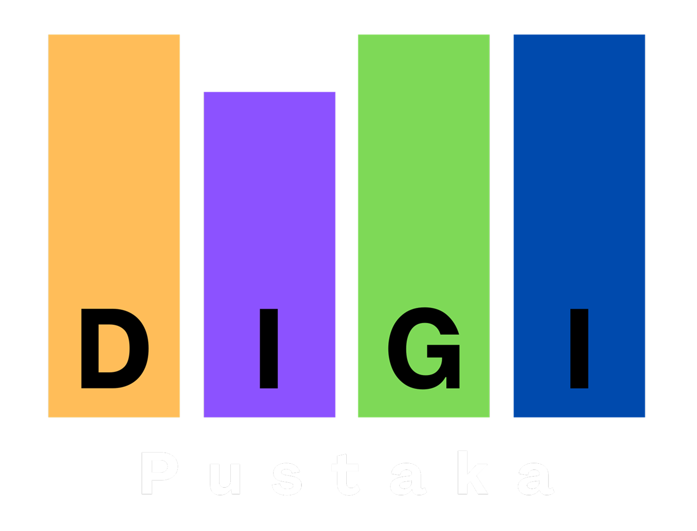
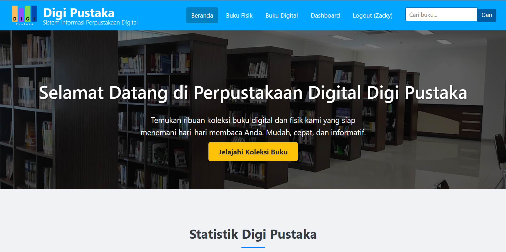
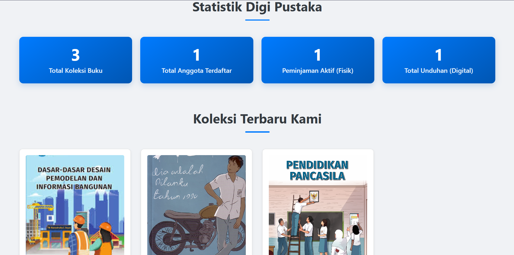
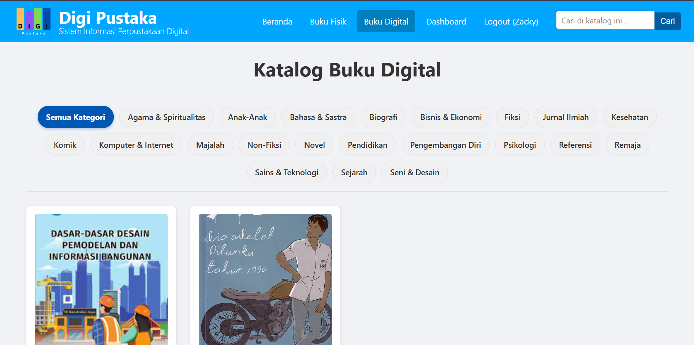
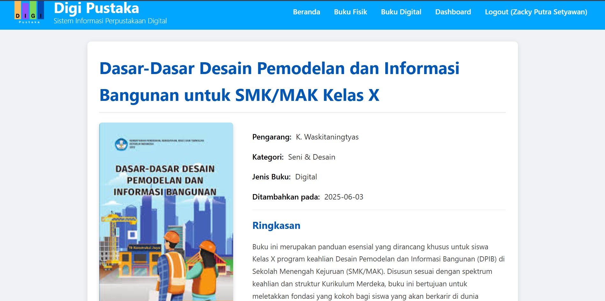
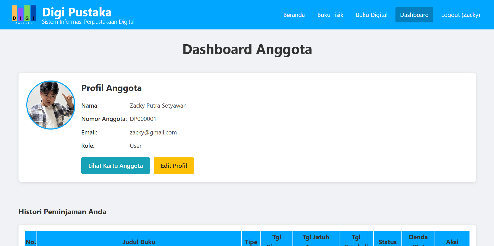
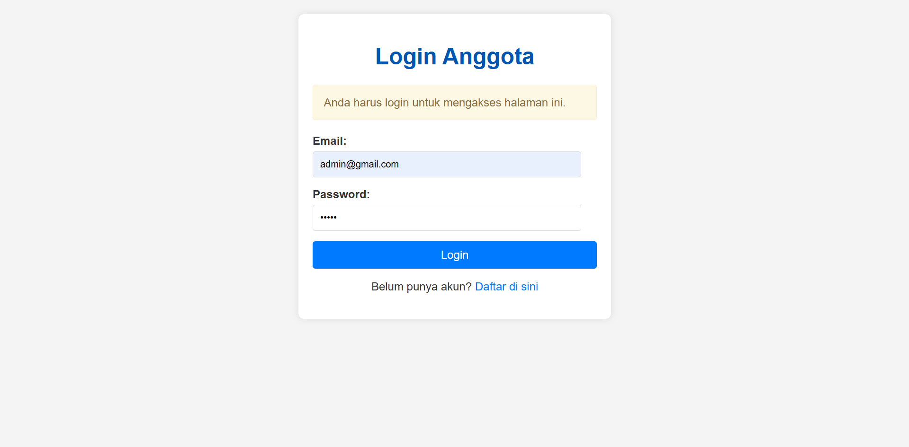
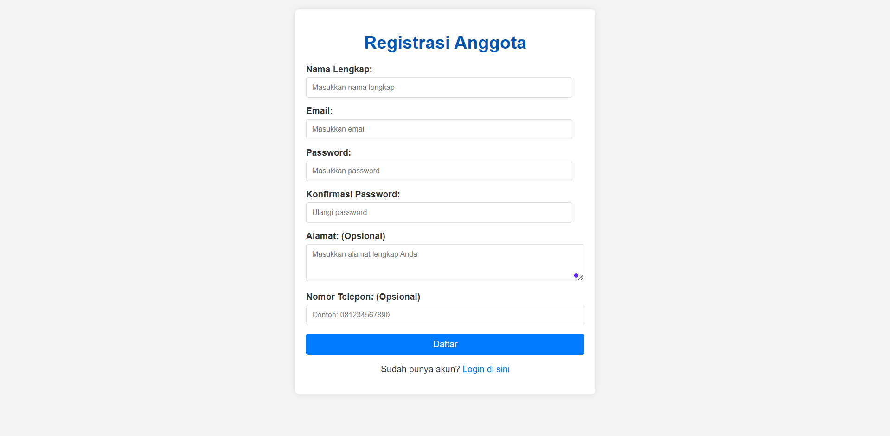
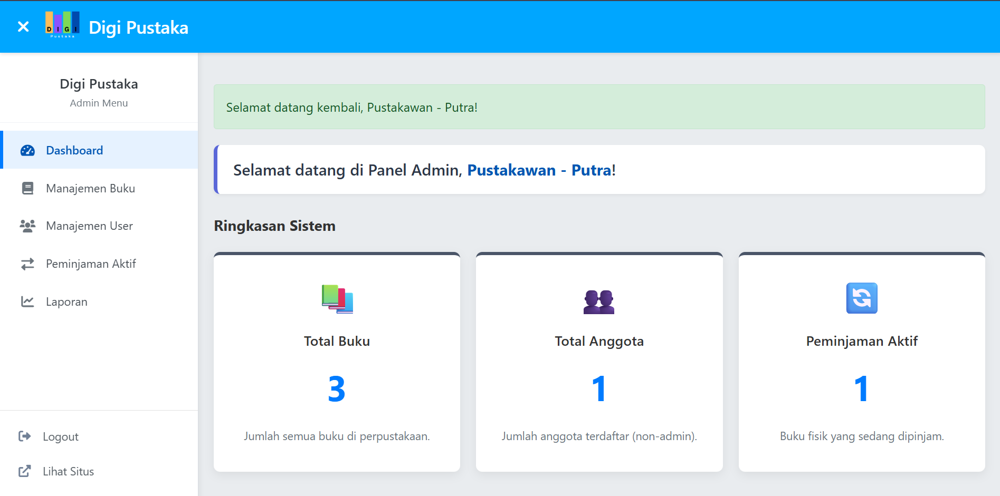

<p align="center">
  
</p>

<h1 align="center">📚 DigiPustaka - Sistem Informasi Perpustakaan Digital 💻</h1>

<p align="center">
  Solusi modern untuk manajemen perpustakaan berbasis web, dibangun dengan Flask & Python.
</p>

<p align="center">
  
  
  
  
</p>

---

## ✨ Fitur Utama

### 👤 Untuk Pengguna/Anggota:

* 🔑 Registrasi dan login akun yang aman.
* 📖 Katalog buku fisik dan digital dengan pencarian dan filter berdasarkan kategori.
* ℹ️ Detail buku: ringkasan, status, dan info lainnya.
* 📅 Peminjaman buku fisik dan unduhan e-book.
* 📊 Dashboard anggota: histori peminjaman, status buku, dan notifikasi jatuh tempo.
* ✏️ Edit profil pribadi.
* 💳 Cetak kartu anggota digital dengan QR Code.

### 🛠️ Untuk Admin:

* 📊 Dashboard admin dengan statistik penting.
* 📖 CRUD koleksi buku, unggah file e-book dan gambar sampul.
* 👥 Manajemen pengguna: lihat, aktifkan/nonaktifkan akun.
* 🗓️ Transaksi peminjaman buku: pengembalian & denda otomatis.
* 📄 Laporan aktivitas perpustakaan.
* 💰 Atur tarif denda keterlambatan.

---

## 🖼️ Tampilan Aplikasi

<details>
  <summary><strong>Klik untuk melihat tampilan aplikasi</strong></summary>

### Halaman Utama

<p align="center">
  
  
</p>

### Katalog Buku Digital

<p align="center">
  
</p>

### Detail Buku

<p align="center">
  
</p>

### Dashboard Anggota

<p align="center">
  
</p>

### Login & Registrasi

<p align="center">
  
  
</p>

### Dashboard Admin

<p align="center">
  
</p>
</details>

---

## 🚀 Teknologi yang Digunakan

* **Backend**: Python 3 + Flask
* **Frontend**: HTML5, CSS3, JavaScript
* **Database**: SQLite
* **Templating**: Jinja2
* **Fitur Tambahan**:

  * Pratinjau PDF (PDF.js)
  * QR Code (qrcode.js)

---

## 🎯 Tujuan Proyek

DigiPustaka bertujuan untuk memodernisasi layanan perpustakaan melalui platform digital yang responsif dan mudah diakses di desktop maupun mobile. Aplikasi ini mendukung kemandirian pengguna dan efisiensi pengelolaan oleh admin.

---

## 🛠️ Cara Instalasi

### Prasyarat:

* Python >= 3.7
* pip
* (Opsional) Git

### Langkah-langkah:

1. **Klon Repository**:

```bash
git clone https://github.com/kidinggg/DigiPustaka.git
cd DigiPustaka
```

2. **Buat & Aktifkan Virtual Environment**:

```bash
python -m venv venv

# Windows
env\Scripts\activate
# macOS/Linux
source venv/bin/activate
```

3. **Install Dependensi**:

```bash
pip install -r requirements.txt
```

4. **Inisialisasi Database**:

```bash
flask init-db
```

5. **Jalankan Aplikasi**:

```bash
flask run
# Atau mode debug
python app.py
```

6. **Akses via Browser**: [http://localhost:5000/](http://localhost:5000/)

---

## 👨‍💻 Pengembang Utama

* **Nama**: Zacky Putra Setyawan
    * **Status**: Mahasiswa Sistem Informasi
    * **Institusi**: Universitas Buana Perjuangan Karawang
    * **Peran**: Full Stack Developer: Backend, Frontend, Database, Integrasi Fitur, testing
    * **Email**: [zackyputra1905@gmail.com](mailto:zackyputra1905@gmail.com)
    * **GitHub**: [@kidinggg](https://github.com/kidinggg)

---

## 🤝 Tim Kontributor

* **Naufal Fauzi Rahman** - Desain UI/UX & Dokumentasi laporan
    * **Status**: Mahasiswa Sistem Informasi
    * **Institusi**: Universitas Buana Perjuangan Karawang
* **Alfiansyah Hidayat** - Desain konten,  Database & Analisis Data Awal
    * **Status**: Mahasiswa Sistem Informasi
    * **Institusi**: Universitas Buana Perjuangan Karawang
* **Farid Firdaus** - Pengelolaan Konten & Pengujian Modul
    * **Status**: Mahasiswa Sistem Informasi
    * **Institusi**: Universitas Buana Perjuangan Karawang
* **Rahma Khoirunnisa** - Database & Riset Pengguna
    * **Status**: Mahasiswa Sistem Informasi
    * **Institusi**: Universitas Buana Perjuangan Karawang

---

---

🚀 Selamat menggunakan DigiPustaka!
